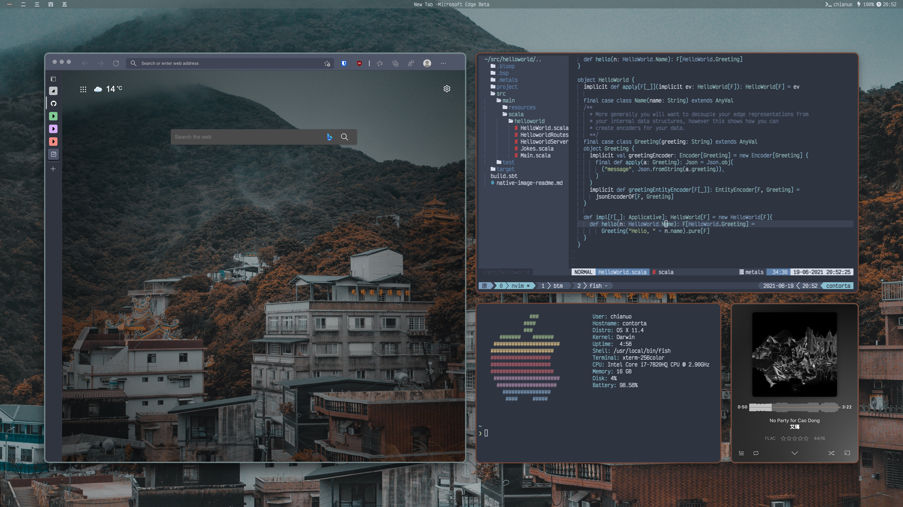

# kahnc's dotfiles

This includes my Neovim configs written in Lua, my Alacritty and Fish shell configs, and macOS tiling window management with Yabai. Commonly used software installed via Homebrew.

Use at your own peril!



## Linking configs

Links configs from `./etc/<dirname>` to `$HOME/.config/<dirname>`:

```
scripts/link.sh
```

## Installing software

Uses Homebrew, see `brew/*.brew` 

```
scripts/install.sh home|work
```

